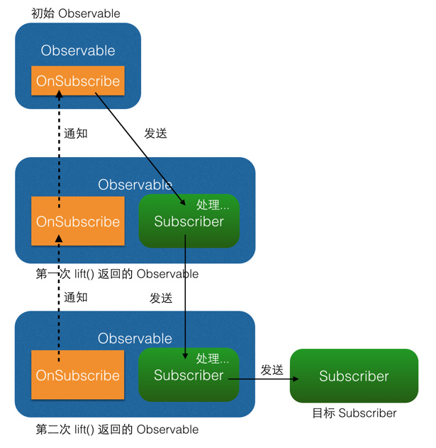
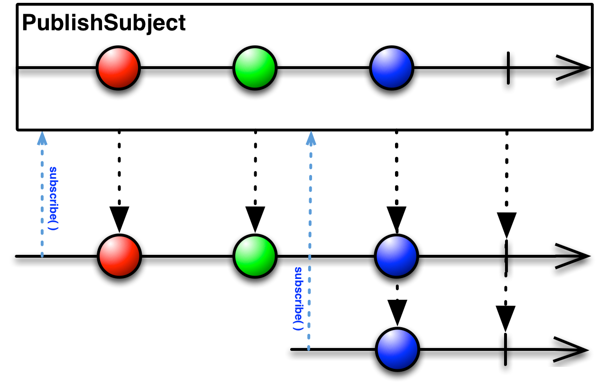
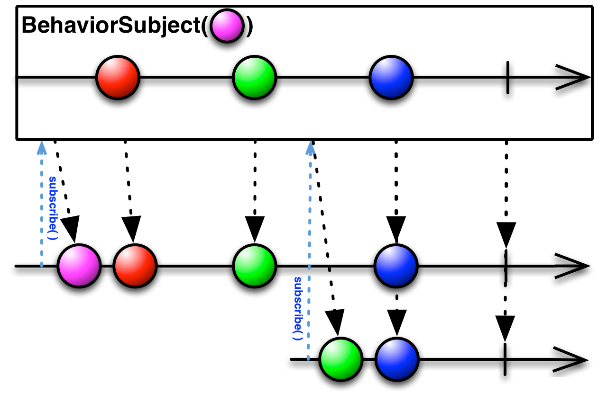
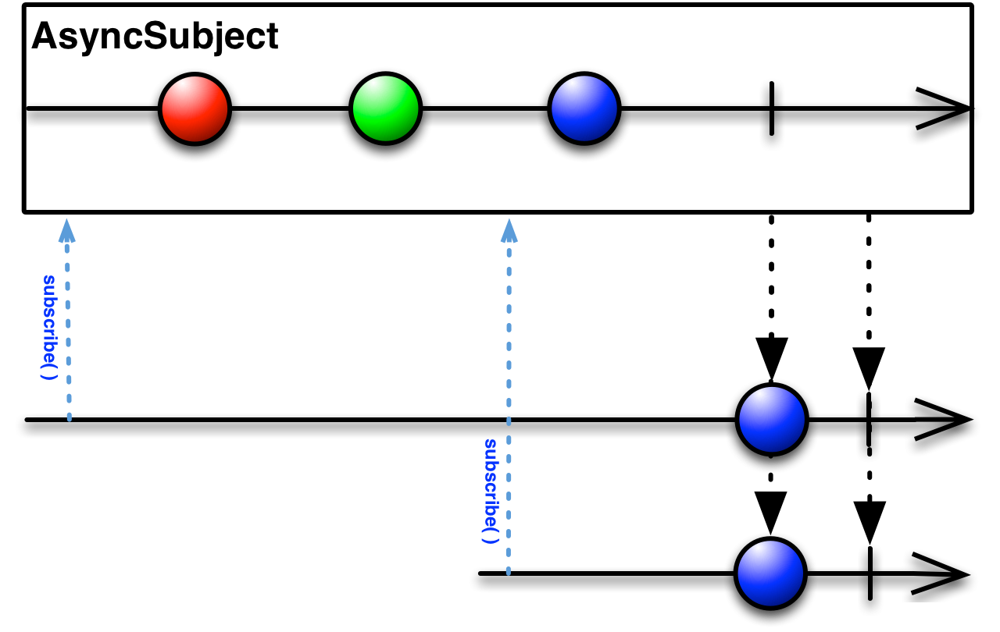
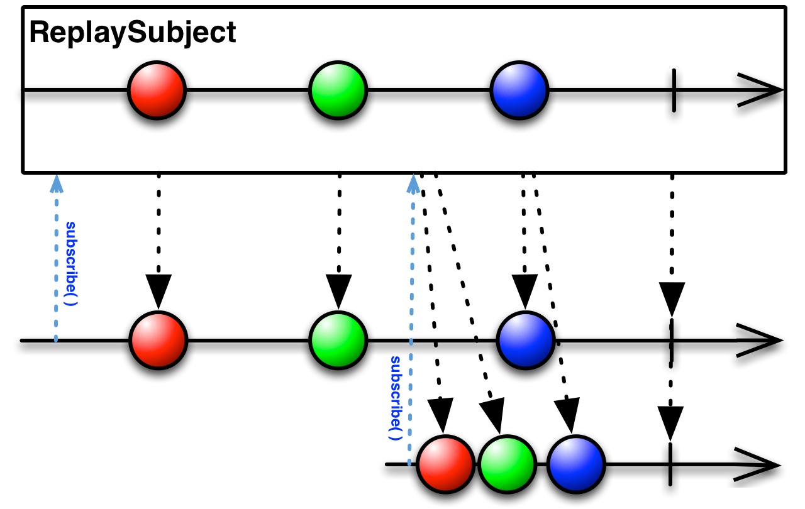

### RxJava
1. RxJava 的观察者模式简单介绍(#1)
*  变换操作map和flatmap的区别
*  变换的原理lift和compose的区别
*  线程控制Scheduler
*  什么是subject
*  Rxjava extension library简单介绍

### RxJava 的观察者模式简单介绍{#1}
RxJava 有四个基本概念：Observable (可观察者，即被观察者)、 Observer (观察者)、 subscribe (订阅)、事件。Observable 和 Observer 通过 subscribe() 方法实现订阅关系，从而 Observable 可以在需要的时候发出事件来通知 Observer。
与传统观察者模式不同， RxJava 的事件回调方法除了普通事件 onNext() （相当于 onClick() / onEvent()）之外，还定义了两个特殊的事件：onCompleted() 和 onError()。
* onCompleted(): 事件队列完结。RxJava 不仅把每个事件单独处理，还会把它们看做一个队列。RxJava 规定，当不会再有新的 onNext() 发出时，需要触发 onCompleted() 方法作为标志。
* onError(): 事件队列异常。在事件处理过程中出异常时，onError() 会被触发，同时队列自动终止，不允许再有事件发出。
* 在一个正确运行的事件序列中, onCompleted() 和 onError() 有且只有一个，并且是事件序列中的最后一个。需要注意的是，onCompleted() 和 onError() 二者也是互斥的，即在队列中调用了其中一个，就不应该再调用另一个。

### 变换操作map和flatmap的区别
RxJava一个非常强大的功能就是对事件序列的变换操作；所谓变换，就是将事件序列中的对象或整个序列进行加工处理，转换成不同的事件或事件序列
RxJava包含许多操作符，例如Transforming 变换操作、Filtering 过滤操作、Combining 结合操作 等等，map和flatmap就属于变换操作

下面以map和flatmap为例，介绍一下变换操作的具体操作
map：对序列的每一项都应用一个函数来变换Observable发射的数据序列
flatmap：将Observable发射的数据集合变换为Observables集合，然后将这些Observable发射的数据平坦化的放进一个单独的Observable

举个例子：一个班有50个学生，我只想获取这个班50个学生的姓名，可以用map操作符来进行如下转换
```
Student[] students = ...;
Observable.from(students)
    .map(new Func1<Student, String>() {
        @Override
        public String call(Student student) {
            return student.getName();
        }
    })
    .buffer(50)
    .subscribe(new Observer<List<String>>() {
    @Override
    public void onNext(List<String> studentNames) {
        Log.i(TAG, studentNames);
    }

    @Override
    public void onCompleted() {}

    @Override
    public void onError(Throwable e) {}
});
```
但是如果我还想查询50个学生的成绩呢？这个时候就要用flatmap了
```
Student[] students = ...;
Observable.from(students)
    .flatMap(new Func1<Student, Observable<Score>>() {
        @Override
        public Observable<Score> call(Student student) {
            return Observable.from(student.getScore());
        }
    })
    .buffer(50)
    .subscribe(new Observer<List<Score>>() {
    @Override
    public void onNext(List<Score> scores) {
        Log.i(TAG, scores);
    }

    @Override
    public void onCompleted() {}

    @Override
    public void onError(Throwable e) {}
});
```
从上面的代码可以看出， flatMap() 和 map() 有一个相同点：它也是把传入的参数转化之后返回另一个对象。但需要注意，和 map() 不同的是， flatMap() 中返回的是个 Observable 对象，并且这个 Observable 对象并不是被直接发送到了 Subscriber 的回调方法中
flatMap() 的原理是这样的：
1. 使用传入的事件对象创建一个 Observable 对象
2. 并不发送这个 Observable, 而是将它激活，于是它开始发送事件
3. 每一个创建出来的 Observable 发送的事件，都被汇入同一个 Observable ，而这个 Observable 负责将这些事件统一交给 Subscriber 的回调方法
这三个步骤，把事件拆成了两级，通过一组新创建的 Observable 将初始的对象『铺平』之后通过统一路径分发了下去。而这个『铺平』就是 flatMap() 所谓的 flat。


### 变换的原理lift和compose的区别

##### 变换的原理：lift()
lift变换实质上都是针对事件序列的处理和再发送。而在 RxJava 的内部，它们是基于同一个基础的变换方法： lift(Operator)。首先看一下 lift() 的内部实现（仅核心代码）：
```
// 注意：这不是 lift() 的源码，而是将源码中与性能、兼容性、扩展性有关的代码剔除后的核心代码。
// 如果需要看源码，可以去 RxJava 的 GitHub 仓库下载。
public <R> Observable<R> lift(Operator<? extends R, ? super T> operator) {
    return Observable.create(new OnSubscribe<R>() {
        @Override
        public void call(Subscriber subscriber) {
            Subscriber newSubscriber = operator.call(subscriber);
            newSubscriber.onStart();
            onSubscribe.call(newSubscriber);
        }
    });
}
```



##### 变换的原理：compose()
compose: 对 Observable 整体的变换
假设在程序中有多个 Observable ，并且他们都需要应用一组相同的 lift() 变换

```
//你可以这么写
observable1
    .lift1()
    .lift2()
    .lift3()
    .lift4()
    .subscribe(subscriber1);
observable2
    .lift1()
    .lift2()
    .lift3()
    .lift4()
    .subscribe(subscriber2);

//也可以这么写
private Observable liftAll(Observable observable) {
	return observable
	    .lift1()
	    .lift2()
	    .lift3()
	    .lift4();
}
liftAll(observable1).subscribe(subscriber1);
liftAll(observable2).subscribe(subscriber2);

//compose的写法
public class LiftAllTransformer implements Observable.Transformer<Integer, String> {
    @Override
    public Observable<String> call(Observable<Integer> observable) {
        return observable
            .lift1()
            .lift2()
            .lift3()
            .lift4();
    }
}
Transformer liftAll = new LiftAllTransformer();
observable1.compose(liftAll).subscribe(subscriber1);
observable2.compose(liftAll).subscribe(subscriber2);
```

### 线程控制Scheduler
RxJava线程控制是用subscribeOn() 和 observeOn()方法实现的
subscribeOn() 指定的是 Observable 发送事件的线程
observeOn() 指定的是 Subscriber 接收Observable发送的数据的线程

subscribeOn() 原理图：


observeOn() 原理图：


subscribeOn() 和 observeOn() 混合使用结构图


### 什么是subject
先看看Subject的定义
```
public abstract class Subject<T, R> extends Observable<R> implements Observer<T> {
    ......
}
```
可见Subject即是Observable又是Observer，因为它是一个Observer，所以它可以订阅一个或多个Observable，又因为它是一个Observable，所以它可以发射数据给Observer

Subject 与 Observable有什么区别呢？
主要的区别是它们发射数据的方式不同，原始的Observable是“冷发射”，就是说只有当Observer订阅它的时候才开始发射数据，
而Subject可以将“冷发射”转变成“热发射”,也就是说Subject可以在Observer订阅之前开始发送数据，当然Observer订阅之后也可以发送数据

```
//可见当执行subscribe()方法时，会调用call方法，在call方法里会发射hello1和hello2数据给Observer
Observable.create(new Observable.OnSubscribe<String>() {
    @Override
    public void call(Subscriber<? super String> subscriber) {
        subscriber.onNext("Hello1");
        subscriber.onNext("Hello2");
        subscriber.onCompleted();
    }
}).subscribe();

//可见subject可以在subscribe()之前或之后发射数据，完全在外面控制的
PublishSubject subject = PublishSubject.create();
subject.onNext("Hello1");
subject.onNext("Hello2");
subject.subscribe();
subject.onNext("Hello3");
subject.onCompleted();
```

####Subject的种类

#### 1. PublishSubject

PublishSubject只会把在订阅发生的时间点之后来自原始Observable的数据发射给观察者，需要注意的是：Subject被创建后到有观察者订阅它之前这个时间段内，可能会有一个或多个数据可能会丢失，例如上面的hello1和hello2会丢失，不会发射给观察者，hello3才会发射给观察者


#### 2. BehaviorSubject

当观察者订阅BehaviorSubject时，它开始发射原始Observable最近发射的数据（如果此时还没有收到任何数据，它会发射一个默认值），然后继续发射其它任何来自原始Observable的数据
```
BehaviorSubject subject = BehaviorSubject.create("default");
subject.subscribe(createObserver());//这是Observer1
subject.onNext("hello1");
subject.subscribe(createObserver());//这是Observer2
subject.onNext("hello2");
subject.onCompleted();
```
subject会将default、hello1、hello2发射给Observer1，会将hello1、hello2发射给Observer2


#### 3. AsyncSubject

只在原始Observable完成后，发射来自原始Observable的最后一个值，如果原始Observable没有发射任何值，AsyncObject也不发射任何值）它会把这最后一个值发射给任何后续的观察者。
```
AsyncSubject asyncSubject = AsyncSubject.create();
asyncSubject.subscribe(createObserver());//这是Observer1
asyncSubject.onNext("hello1");
asyncSubject.onNext("hello2");
asyncSubject.subscribe(createObserver());//这是Observer2
asyncSubject.onNext("hello3");
asyncSubject.onCompleted();
```
subject只会将hello3发送给Observer1和Observer2


#### 4. ReplaySubject

ReplaySubject会发射所有来自原始Observable的数据给观察者，无论它们是何时订阅的。也有其它版本的ReplaySubject，在重放缓存增长到一定大小的时候或过了一段时间后会丢弃旧的数据（原始Observable发射的）。
```
ReplaySubject subject = ReplaySubject.create();
subject.subscribe(createObserver());//这是Observer1
subject.onNext("hello1");
subject.onNext("hello2");
subject.onNext("hello3");
subject.subscribe(createObserver());//这是Observer2
subject.onCompleted();
```
subject只会将hello1、hello2、hello3发送给Observer1和Observer2



